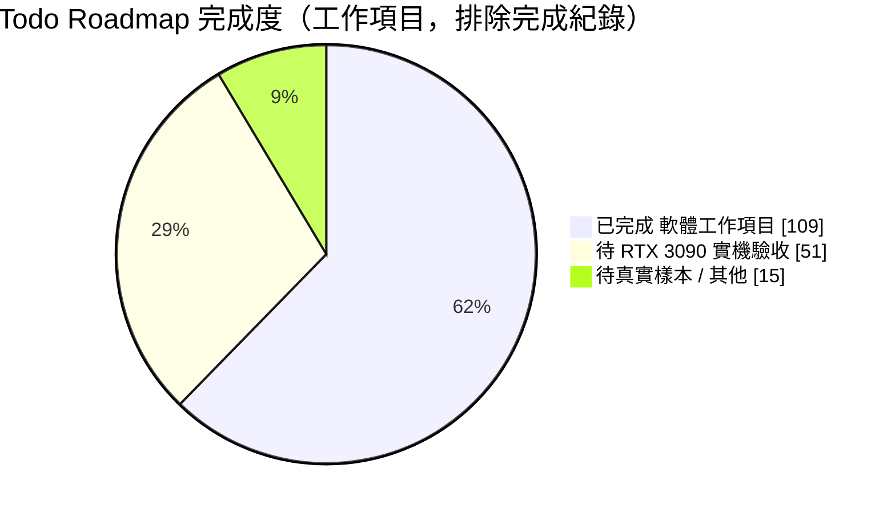
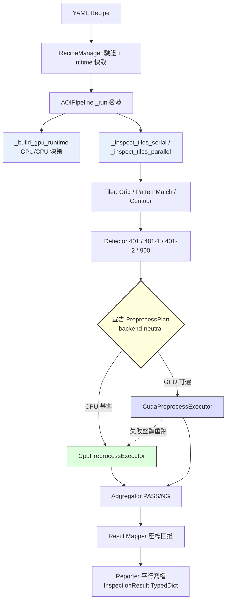
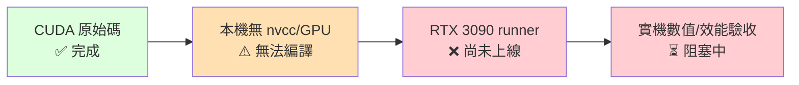

# 🔬 VisionFlow AOI — 專案綜合評價報告

> **評價日期**：2026-07-18（更新版）　|　**開發週期**：約 1 個月（2026-06-24 ～ 2026-07-18）
> **評價對象**：配方驅動的 OpenCV 自動光學檢測系統（含 CUDA GPU 可選加速後端）
> **評價基準**：程式碼、測試套件、CI 設定、`Todo.md` roadmap、文件與工程紀律
> **版本異動**：本次納入 2026-07-18 的 **P9 第一批 CPU 優化交付**（tile 級平行、Reporter 平行寫檔、recipe 快取、`result_types.py` TypedDict、CI coverage gate、overlay 輸出策略），並據此上修多項分數。

---

## 📊 一、總體評分儀表板

<table>
<tr>
<td align="center" width="33%">

### 綜合總分
# **88 / 100**
🏅 **A（優等）**
<br><sub>▲ 前次 85</sub>

</td>
<td align="center" width="33%">

### 工程成熟度
# **CPU 生產就緒**
⚙️ GPU 待實機驗收

</td>
<td align="center" width="33%">

### 專案體量
# **~21K 行**
📦 Py 18.4K + CUDA 2.6K
<br><sub>123 測試 / 14 檔</sub>

</td>
</tr>
</table>

**一句話評語**：這是一個**架構設計與工程紀律遠超一般個人一個月產出**的專案。以「CPU 為正確性基準、GPU 為可選加速」為核心哲學，建立了乾淨的 `PreprocessPlan` 抽象層、完整的測試與追溯體系。**本次更新更把先前列為「技術債」的 P9 優化清單大量落地並以測試固定**，CPU 側成熟度明顯提升。**唯一的重大「未完成」仍是硬體問題**——所有 CUDA 實機數值/效能驗證卡在「開發機無 NVIDIA GPU / RTX 3090 runner 尚未上線」。

---

## 🆕 二、本次更新亮點（2026-07-18 P9 交付）

> 上次評價時，P9 是一份「**待評估的技術債清單**」。本次它已從「候選」轉為「**已實作 + 測試驗證**」，這是分數上修的主因。

| P9 項目 | 前次狀態 | 現況 | 影響面向 |
|---------|:--------:|:----:|----------|
| Tile×detector 迴圈 CPU 平行 | ❌ 待評估 | ✅ opt-in `_inspect_tiles_parallel`（thread-local detectors，序列/平行逐位元等價） | 🚀 效能 |
| Reporter 序列寫檔 | ❌ 待評估 | ✅ NG tile PNG/JSON bounded thread pool 平行、`png_compression` 可設定 | 🚀 效能 |
| Batch 重複 parse recipe | ❌ 待評估 | ✅ process-wide path+mtime 快取，deepcopy 回傳、mtime 失效 | 🚀 效能 |
| Batch worker 寫死 4 | ❌ 待評估 | ✅ `min(8,cpu)` + `_opencv_thread_budget` 防 oversubscription | 🚀 效能 |
| 每張 `gc.collect(0)` | ❌ 待評估 | ✅ 可設定週期 `AOI_BATCH_GC_INTERVAL`（預設 8） | 🚀 效能 |
| `AOIPipeline._run` 220 行長方法 | ❌ 技術債 | ✅ 抽出 `_build_gpu_runtime` / `_inspect_tile` / serial-parallel 分派 | 🧹 可維護 |
| 深層 dict 字串 key | ❌ 技術債 | ✅ `core/result_types.py` **TypedDict 契約** + contract test | 🧹 可維護 |
| PR CI 缺 coverage/benchmark gate | ❌ 待評估 | ✅ Windows CI 加 **coverage gate（≥70%，現況 76%）** + tile-parallel smoke | ⚙️ CI |
| per-detector debug image export | ❌ 待評估 | ✅ `save_debug_images`（涵蓋 401/401-1/401-2/900，不進 JSON） | 🖥️ 產品 |
| Overlay 輸出策略 | — | ✅ `overlay_format`(png/jpg)/`overlay_jpeg_quality`/`overlay_max_dim`（2048² 38.8ms→18.0ms） | 🚀 效能 |

> **測試成長**：107 → **123 個測試方法**（14 檔），新增 `tests/test_p9_optimizations.py` 固定序列/平行數值等價。全套綠燈 + 6 影像 batch E2E（54 tiles / 54 debug / 0 error）實跑成功（依 `Todo.md` 完成紀錄）。

---

## 🎯 三、九大面向評分明細

| # | 評價面向 | 分數 | Δ | 等級 | 視覺化 |
|---|----------|:----:|:--:|:----:|--------|
| 1 | 📝 文件與工程紀律 | **95** | — | A+ | `███████████████████░` |
| 2 | 🏛️ 系統架構設計 | **94** | ▲1 | A | `██████████████████▊░` |
| 3 | ✅ CPU 正確性基準 | **92** | — | A | `██████████████████▍░` |
| 4 | 🧪 測試與品質保證 | **91** | ▲3 | A | `██████████████████▏░` |
| 5 | 🔒 產線安全與可追溯 | **90** | — | A | `██████████████████░░` |
| 6 | 🖥️ GUI / 使用者體驗 | **89** | ▲1 | A− | `█████████████████▊░░` |
| 7 | 🧹 可維護性與技術債 | **87** | ▲7 | A− | `█████████████████▍░░` |
| 8 | ⚙️ CI/CD 與自動化 | **86** | ▲4 | A− | `█████████████████▎░░` |
| 9 | 🚀 GPU / CUDA 加速實作 | **78** | — | B+ | `███████████████▌░░░░` |
| — | **效能驗證成熟度**（獨立觀察） | **72** | ▲7 | B− | `██████████████▍░░░░░` |



> **Roadmap 統計**：231 個 checkbox 中 165 個已勾選（71%）。扣除 56 筆「完成紀錄」日誌後，實質工作項目約 **109 項完成 / 66 項待辦**；待辦仍有 **~77%（約 51 項）屬於「需要 RTX 3090 實體硬體」**才能勾選，並非程式尚未撰寫。

---

## 🏛️ 四、面向深度剖析

### 1️⃣ 文件與工程紀律 — **95 / 100** 🟢 最高分

- 📖 `CLAUDE.md` / `AGENT.md` 雙份規範（快速索引 + 完整契約）+ 唯一 `Todo.md` roadmap，杜絕分散 Todo。
- 📅 三份週報流水帳 + 56 筆帶日期的完成紀錄，每筆都寫清楚「做了什麼、測了什麼、什麼保持待辦」。
- 🎯 **最可貴的紀律**：反覆強調「**未實際執行 nvcc 就不得聲稱 CUDA 已編譯/驗證**」，所有 RTX 項目誠實保持未勾。本次 P9 交付同樣誠實標註「resident-ROI 非 grid、`gpu_runtime` 拆分因需 RTX 或屬高風險而**另案延後**」，不硬湊完成率。

### 2️⃣ 系統架構設計 — **94 / 100** 🟢（▲1）



**本次進步**：`_run` 長方法拆分成 `_build_gpu_runtime` / `_inspect_tile` / serial-parallel 分派，決策可獨立測試——這正是上次評價指出的技術債。
**仍在**：`PreprocessPlan` typed operators、三種 `gpu.mode` 語意、GPU 失敗整體 CPU 重跑等核心不變量維持完整。

### 3️⃣ CPU 正確性基準 — **92 / 100** 🟢

fallback 等價、固定 seed 合成測例、拒絕語意近似替換、五配方 golden regression 一應俱全；**本次 tile 平行路徑亦以「序列/平行逐位元一致」測試固定**，未因效能犧牲正確性。唯一缺口仍是**真實 AOI 影像樣本**。

### 4️⃣ 測試與品質保證 — **91 / 100** 🟢（▲3）

```
測試檔案：14 個   |   測試方法：123 個（▲16）   |   coverage：76%（gate ≥70%）
```
新增 `test_p9_optimizations.py` 涵蓋 recipe 快取、worker 分配、GC 週期、Reporter 平行、tile 平行等價、debug export、overlay 策略、TypedDict contract。搭配既有 Hypothesis property fuzzing 與 CUDA source contract test，形成「**無 GPU 也能驗證多數邏輯**」的分層。

### 5️⃣ 產線安全與可追溯 — **90 / 100** 🟢

recipe/build SHA-256 provenance、NG sidecar、strict schema、Windows dependency lock 維持紮實；新增 debug image export 提升現場調機追溯性（runtime-only，不污染 JSON）。

### 6️⃣ GUI / 使用者體驗 — **89 / 100** 🟢（▲1）

單張 / OP / Batch / Dashboard / Monitor / Recipe Designer 六大面向完整；overlay 可輸出 JPG 預覽降低顯示負擔。Dashboard 大資料量虛擬化仍列 P9 延後（headless 難驗證）。

### 7️⃣ 可維護性與技術債 — **87 / 100** 🟡（▲7 最大進步）

| 上次技術債 | 現況 |
|-----------|:----:|
| `AOIPipeline._run` 220 行長方法 | ✅ 已拆分 |
| 深層 dict 字串 key | ✅ `result_types.py` TypedDict + contract test |
| Batch worker/GC 硬編碼 | ✅ 可設定 + 動態 |
| `gpu_runtime.py` ~1200 行單檔 | ⏳ **刻意延後**（高風險、需 RTX 驗收，不與 CPU 優化混合） |
| 跨 detector preprocess cache | ⏳ 延後（受「RTX 證明收益後才做」約束） |

> 剩餘技術債都**有意識地延後並記錄理由**，而非遺漏——這是成熟訊號。

### 8️⃣ CI/CD 與自動化 — **86 / 100** 🟡（▲4）

Windows CI 新增 **coverage gate（`--fail-under=70`，現況 76%）** 與 tile-parallel CPU smoke（`AOI_TILE_WORKERS=4`）。RTX self-hosted runner（labels 完整、fork PR 隔離、48h heartbeat / P95 gate）**設計完整但仍未上線接單**（dispatch 持續 queued）——這是唯一壓分點。

### 9️⃣ GPU / CUDA 加速實作 — **78 / 100** 🟡（未變）

原始碼層完整（separable Gaussian、64-bit integral、persistent context、通用 native plan ABI、resident image/ROI、batch gather、CUDA event 計時），但**一行 CUDA 仍未在真實 GPU 驗證數值與效能**。



---

## 🌟 五、核心亮點 TOP 5

1. 🏗️ **抽象層設計典範** — `PreprocessPlan` 讓 CPU/GPU 語意統一，detector 零重複 CUDA 程式。
2. 🧭 **正確性優先哲學貫徹到底** — fallback 等價、拒絕語意近似替換、tile 平行仍逐位元一致。
3. 🔄 **從「技術債清單」到「已交付並測試」** — P9 一批 CPU 優化落地，含真實 CPU benchmark 數據。
4. 📋 **誠實的工程紀律** — 未跑 nvcc 絕不聲稱已驗證，延後項目明列理由。
5. 🔐 **產線級追溯** — recipe/build SHA-256 provenance + NG sidecar + strict schema + debug export。

## ⚠️ 六、關鍵風險與待辦

| 風險 | 等級 | 說明 |
|------|:----:|------|
| **RTX 3090 runner 未上線** | 🔴 高 | GPU 加速的實際收益、數值等價、穩定性**尚未被證實**，是專案價值兌現的唯一瓶頸 |
| **無真實 AOI 樣本** | 🟠 中 | 誤判/漏判率、生產 recipe 等價僅有合成資料 |
| **GPU 效能仍是「假設」** | 🟠 中 | 1.5× 加速門檻尚無實測數據；CPU 側已有實測（overlay 2.1×、batch 平行） |
| **`gpu_runtime.py` 技術債** | 🟡 低 | 已規劃拆分但延後至 RTX 驗收後 |

---

## 🏁 七、結論

```
┌─────────────────────────────────────────────────────────────┐
│  一個月的產出，達到「架構完備、CPU 生產就緒、GPU 蓄勢待發」    │
│                                                               │
│   軟體工程層面：  ★★★★★  (優等，超出一個月合理預期)          │
│   CPU 生產就緒：  ★★★★☆  (P9 優化落地，缺真實樣本)          │
│   GPU 加速兌現：  ★★☆☆☆  (寫完但零實機驗證，卡硬體)          │
│                                                               │
│   >>> 綜合：88 / 100　A（優等）　▲ 前次 85                     │
└─────────────────────────────────────────────────────────────┘
```

**為何上修至 88 分**：本次更新把先前壓分的「技術債 / 待評估」項目大量轉為「**已實作 + 測試固定 + 有 benchmark 數據**」，可維護性（+7）、CI（+4）、測試（+3）、效能驗證成熟度（+7）皆實質提升。被扣掉的 12 分**幾乎全部來自一件無法靠寫程式解決的事**：沒有 RTX 3090 可以編譯與實測 CUDA。

**下一步關鍵路徑（解鎖 92+ 分）**：
1. 🖥️ 讓 RTX 3090 self-hosted runner 上線接單。
2. 🔧 `sm_86` 重建 DLL，跑完 primitive 容差 + fused 等價矩陣。
3. 📈 取得純檢測 median/P95 speedup 實測，驗證 ≥1.5× 門檻。
4. 🧵 1000 張長時間壓測，確認 VRAM 平台與無洩漏。
5. 📷 導入真實 AOI PASS/NG 樣本，完成五配方生產等價。

> **CPU 側已接近生產就緒；一旦硬體驗收通過，本專案即可從「架構就緒」躍升為「生產部署就緒」，綜合分數具備上看 92+ 的實力。**

---

<sub>📄 本報告依 2026-07-18 當日 codebase、`Todo.md`、測試套件（123 methods）與 CI 設定產生。GPU 相關評分刻意保守，因所有 CUDA 實機數據尚待 RTX 3090 驗收；報告不聲稱任何未經實機驗證的 CUDA 效能或正確性結論。CPU 側 benchmark 數據引用自 `Todo.md` 完成紀錄，本評價環境無專案 venv 故未重跑測試。</sub>
