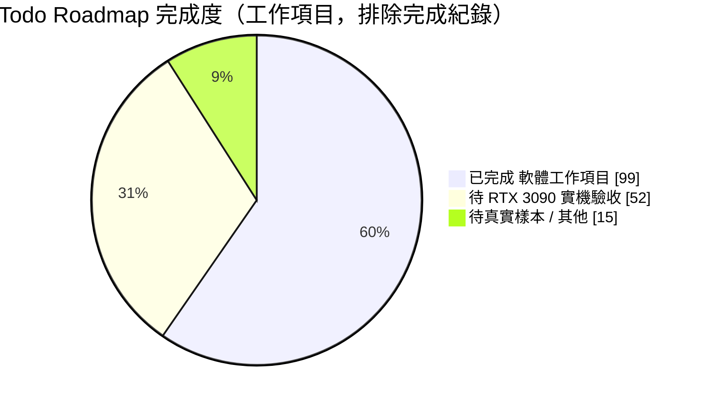
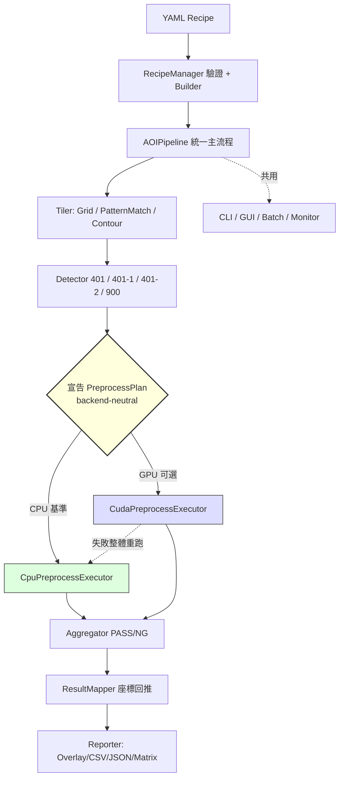
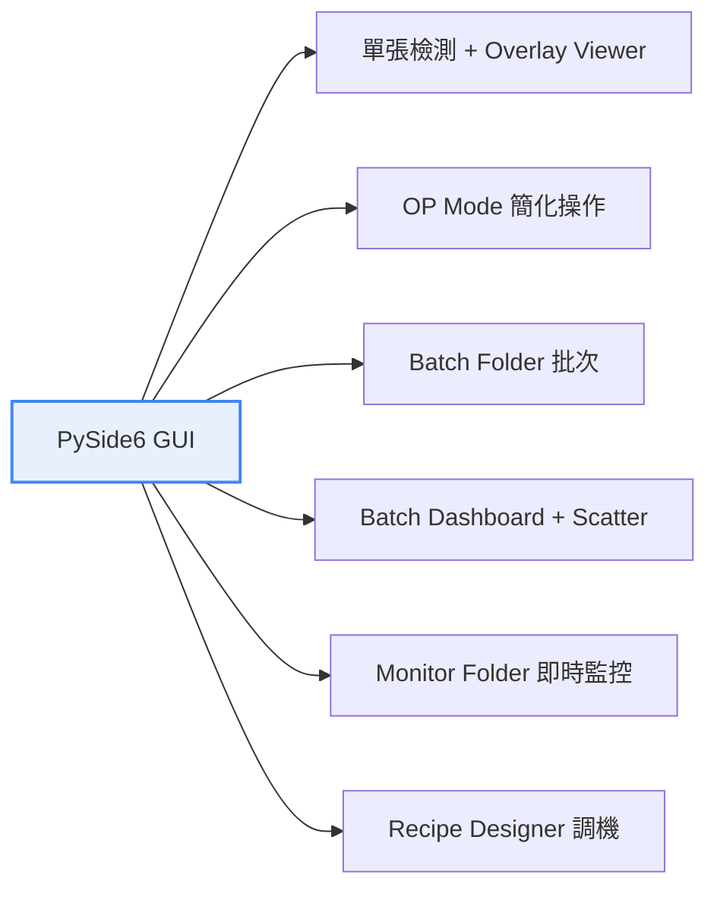

# 🔬 VisionFlow AOI — 專案綜合評價報告

> **評價日期**：2026-07-17　|　**開發週期**：約 1 個月（2026-06-24 ～ 2026-07-17）
> **評價對象**：配方驅動的 OpenCV 自動光學檢測系統（含 CUDA GPU 可選加速後端）
> **評價基準**：程式碼、測試套件、CI 設定、`Todo.md` roadmap、文件與工程紀律

---

## 📊 一、總體評分儀表板

<table>
<tr>
<td align="center" width="33%">

### 綜合總分
# **85 / 100**
🏅 **A－（優等）**

</td>
<td align="center" width="33%">

### 工程成熟度
# **架構就緒**
⚙️ 待實機驗收

</td>
<td align="center" width="33%">

### 專案體量
# **~20K 行**
📦 Py 17.7K + CUDA 2.6K

</td>
</tr>
</table>

**一句話評語**：這是一個**架構設計遠超一般個人一個月產出**的專案。以「CPU 為正確性基準、GPU 為可選加速」為核心哲學，建立了乾淨的 `PreprocessPlan` 抽象層、完整的測試與追溯體系、以及誠實的工程紀律。**唯一的「未完成」不是能力問題，而是硬體問題**——所有 CUDA 實機數值/效能驗證都卡在「開發機沒有 NVIDIA GPU / RTX 3090 runner 尚未上線」。

---

## 🎯 二、九大面向評分明細

| # | 評價面向 | 分數 | 等級 | 視覺化 |
|---|----------|:----:|:----:|--------|
| 1 | 🏛️ 系統架構設計 | **93** | A | `██████████████████▌░` |
| 2 | ✅ CPU 正確性基準 | **92** | A | `██████████████████▍░` |
| 3 | 🧪 測試與品質保證 | **88** | A－ | `█████████████████▌░░` |
| 4 | 🔒 產線安全與可追溯 | **90** | A | `██████████████████░░` |
| 5 | 📝 文件與工程紀律 | **95** | A+ | `███████████████████░` |
| 6 | 🖥️ GUI / 使用者體驗 | **88** | A－ | `█████████████████▌░░` |
| 7 | ⚙️ CI/CD 與自動化 | **82** | B+ | `████████████████▍░░░` |
| 8 | 🚀 GPU / CUDA 加速實作 | **78** | B+ | `███████████████▌░░░░` |
| 9 | 🧹 可維護性與技術債 | **80** | B+ | `████████████████░░░░` |
| — | **效能驗證成熟度**（獨立觀察） | **65** | C+ | `█████████████░░░░░░░` |



> **Roadmap 統計**：220 個 checkbox 中 153 個已勾選（70%）。扣除 55 筆「完成紀錄」日誌後，實質工作項目約 **99 項完成 / 67 項待辦**；而待辦的 **~78%（52 項）屬於「需要 RTX 3090 實體硬體」才能勾選**，並非程式尚未撰寫。

---

## 🏛️ 三、面向深度剖析

### 1️⃣ 系統架構設計 — **93 / 100** 🟢

專案最強項。核心是「**一條 pipeline、多種入口**」與「**backend-neutral 抽象**」兩大設計。



**亮點**
- ✅ **`PreprocessPlan` typed operators**（Gray/Resize/Gaussian/Threshold/AdaptiveMean/Morphology）讓 detector 只宣告「要做什麼」，由 CPU/CUDA executor 決定「怎麼做」——徹底避免每個 detector 各自寫一套 CUDA。
- ✅ **不變量清楚**：`cpu` 絕不載入 CUDA、`auto` 可安全 fallback、`cuda` 禁止隱藏 fallback，三種語意在 recipe/pipeline/session/GUI 全鏈一致。
- ✅ **GPU step 失敗 → 整個 detector 從 CPU 重跑**，不混用部分 GPU 中間結果，正確性優先於效能。
- ✅ DAG / multi-output plan：一次 gray 產生多張 mask（如 detector 900），一次 upload、連續 kernel、最後才 download。

**扣分**
- ⚠️ `core/gpu_runtime.py` 單檔 **1,196 行（~53KB）**，職責過重（ABI binding + resident image + metrics + fallback policy），已在 P9 列為待拆分。
- ⚠️ `execution.gpu.metrics...` 深層 dict 字串 key 存取，缺 `TypedDict`/`dataclass` 型別保護。

---

### 2️⃣ CPU 正確性基準 — **92 / 100** 🟢

「CPU-only 是完整受支援模式，也是正確性基準」不只是口號，有實質保護。

| 保護機制 | 狀態 |
|----------|:----:|
| 缺 DLL 時 CPU fallback 與純 CPU 結果完全一致（PASS/NG/tiles/bbox/metadata） | ✅ |
| 固定 seed 合成測例（BGR/gray/全黑/全白/棋盤/邊界） | ✅ |
| 奇數尺寸、極小圖、4K、non-contiguous stride、1/3 channel、ROI 尺寸 | ✅ |
| 拒絕語意不等價替換（如 nearest-neighbor 冒充 `INTER_AREA`） | ✅ |
| `fallback_to_cpu: false` + 無 DLL → 明確失敗，不回報假 GPU success | ✅ |
| 五份 recipe 合成 PASS/NG golden regression（每 detector ≥5 案例） | ✅ |
| **真實 AOI 影像測例** | ⏳ 待生產樣本 |

> **成熟度亮點**：connected components 曾被評估取代 findContours，但因 pixel area / 孔洞語意不等價、且 4K benchmark 無收益而**主動放棄**——這是「不為快而犧牲正確性」的紀律體現。

---

### 3️⃣ 測試與品質保證 — **88 / 100** 🟢

```
測試檔案：13 個   |   測試方法：107 個   |   測試碼：~3,024 行
```

| 測試模組 | 涵蓋範圍 |
|----------|----------|
| `test_cpu_correctness.py` | CPU 基準與 fallback 等價 |
| `test_preprocess_properties.py` | **Hypothesis 隨機影像 + 合法 plan** 對照 OpenCV reference |
| `test_detector_migrations.py` | 401/401-1/401-2/900 遷移語意保留 |
| `test_cuda_source_contract.py` | CUDA 原始碼 ABI / 生命週期契約（無需 GPU） |
| `test_gpu_session.py` / `test_gpu_policy.py` | 長生命週期 session、auto/cpu/cuda 政策 |
| `test_production_contracts.py` | 五配方 schema、provenance、golden |
| `test_gui_*.py` | GUI threading、packaging、observability |

**亮點**：property-based fuzzing + source contract test 讓「沒有 GPU 也能驗證 CUDA 邏輯正確性」，這是聰明的分層。
**扣分**：無 code coverage gate（P9 已列），PR CI 缺 `benchmark_gate` smoke。

---

### 4️⃣ 產線安全與可追溯 — **90 / 100** 🟢

工業檢測系統最該重視、也最常被忽略的一環，這裡做得紮實：

- 🔐 保存**原始 recipe SHA-256** + 套用 override 後的 **effective recipe SHA-256** + build commit/dirty provenance。
- 🏷️ 每張 NG tile 旁產生 **dataset metadata sidecar**（recipe provenance、detector/參數、局部+全域座標、來源影像、人工複判欄位）。
- 🛡️ Detector 宣告共用參數 schema，recipe 載入**嚴格拒絕**未知 detector/參數/型別/越界/非法 enum，GUI designer 共用同一 schema。
- 📌 Windows 精確 dependency lock（hosted CI / RTX runner / PyInstaller 同一份），避免版本漂移。

---

### 5️⃣ 文件與工程紀律 — **95 / 100** 🟢 最高分

- 📖 `CLAUDE.md` / `AGENT.md` 雙份規範（快速索引 + 完整契約）+ 唯一 `Todo.md` roadmap，杜絕分散 Todo。
- 📅 三份週報流水帳（2026-06-24 起）+ 55 筆帶日期的完成紀錄。
- 🎯 **最可貴的紀律**：反覆強調「**未實際執行 nvcc 就不得聲稱 CUDA 已編譯/驗證**」，所有 RTX 項目誠實保持未勾。這種「不謊報進度」的自律，在評估中是加分關鍵。
- 🧰 `.claude/skills/aoi-verify-push` 把驗證矩陣→Todo 更新→安全 staging→commit/push 固化成流程。

---

### 6️⃣ GUI / 使用者體驗 — **88 / 100** 🟢

`gui/` 達 **6,265 行**，功能面向完整覆蓋工程師與現場 OP 雙角色：



**亮點**：GUI worker 不在 UI thread 等 CUDA（moveToThread + Qt signals）；顯示**實際 backend**，不會因勾選 GPU 就假顯示 CUDA active。
**扣分**：Batch dashboard/scatter 大資料量時的表格虛擬化與圖表抽樣仍待做（P9）。

---

### 7️⃣ CI/CD 與自動化 — **82 / 100** 🟡

| 管線 | 狀態 |
|------|:----:|
| Windows runner：unit tests + compileall + recipe/CLI/GUI smoke + CUDA 靜態檢查 | ✅ |
| DLL 用 SHA-256 source manifest 分開編譯（非 glob 掃 `.cu`）+ preflight 驗證 | ✅ |
| RTX 3090 self-hosted runner（`self-hosted/Windows/X64/gpu/rtx3090` labels） | ✅ 設定完成 |
| 不信任 fork PR 禁止跑 self-hosted runner | ✅ |
| RTX 48h heartbeat / P95 15% 退化 gate / weekly package smoke | ✅ |
| **RTX runner 實際上線接單** | ❌ 手動 dispatch `29574501971` 持續 queued |

> 扣分主因：CI **設計完整但 GPU job 從未真正執行過**（runner 未上線），benchmark baseline 尚屬空殼。

---

### 8️⃣ GPU / CUDA 加速實作 — **78 / 100** 🟡

程式**寫得很完整**，但**一行 CUDA 都還沒在真實 GPU 上驗證過數值與效能**——這是分數被壓住的唯一原因。

**已完成（原始碼層級）**
- ✅ Separable Gaussian + constant-memory weights；64-bit integral image Adaptive Mean（O(1) 視窗）。
- ✅ Persistent context + grow-only buffers（相同/較小尺寸不重複 `cudaMalloc/cudaFree`）。
- ✅ 通用 native plan ABI（versioned、detector-neutral structs）+ linear/DAG/multi-output executor。
- ✅ Resident image + device ROI（原圖一次 upload，子 ROI 對應 tile，額外 H2D 為零）。
- ✅ ROI batch gather kernel、自動批次大小（依 `cudaMemGetInfo`）、配置失敗逐級降批無 stale handle。
- ✅ `VfCudaTimingsV1` CUDA event 分項計時（H2D/kernel/D2H/Gaussian/AdaptiveMean/threshold/morphology）。

**未完成（全部卡硬體）** ⏳
- ❌ RTX 3090 `sm_86` 重新編譯 DLL / 通過 `dumpbin` exports 檢查。
- ❌ 各 primitive 與 CPU 的像素容差驗證、fused plan 等價矩陣。
- ❌ `INTER_AREA` resize 的真實 CUDA 像素等價（CPU 模擬已一致）。
- ❌ 純檢測 median/P95 speedup ≥1.5×、1000 張 VRAM 平台、連續三輪無 error。


---

### 9️⃣ 可維護性與技術債 — **80 / 100** 🟡

專案已**自我盤點**技術債並列入 P9，這本身是成熟訊號。主要項目：

| 技術債 | 影響 | 狀態 |
|--------|------|:----:|
| `gpu_runtime.py` ~53KB 單檔 | 維護/測試成本高 | 待拆分 |
| `AOIPipeline._run` ~220 行長方法 | 決策難獨立測試 | 待抽 `ExecutionPlan` |
| 深層 dict 字串 key（`execution.gpu.metrics...`） | 打錯 key 風險 | 待 TypedDict |
| tile preprocess cache 只快取 gray | resize/gaussian 各 detector 重算 | 待擴充 |
| 單張 tile×detector 迴圈全序列 | 未用多核 | 待評估 ThreadPool |

---

## 🌟 四、核心亮點 TOP 5

1. 🏗️ **抽象層設計典範** — `PreprocessPlan` 讓 CPU/GPU 語意統一，detector 零重複 CUDA 程式。
2. 🧭 **正確性優先哲學貫徹到底** — fallback 等價、拒絕語意近似替換、主動放棄無收益優化。
3. 🔍 **無 GPU 也能驗證 GPU 邏輯** — source contract test + property fuzzing + fake DLL 生命週期。
4. 📋 **誠實的工程紀律** — 未跑 nvcc 絕不聲稱已驗證，硬體項目誠實留空。
5. 🔐 **產線級追溯** — recipe/build SHA-256 provenance + NG sidecar + strict schema。

## ⚠️ 五、關鍵風險與待辦

| 風險 | 等級 | 說明 |
|------|:----:|------|
| **RTX 3090 runner 未上線** | 🔴 高 | 所有 GPU 加速的實際收益、數值等價、穩定性**尚未被證實**，是專案價值兌現的唯一瓶頸 |
| **無真實 AOI 樣本** | 🟠 中 | 誤判/漏判率、生產 recipe 等價僅有合成資料，缺真實分佈驗證 |
| **GPU 效能是「假設」非「事實」** | 🟠 中 | 1.5× 加速門檻尚未有任何實測數據支撐 |
| **`gpu_runtime.py` 技術債** | 🟡 低 | 隨 GPU 功能增長，單檔複雜度將持續上升 |

---

## 🏁 六、結論

```
┌─────────────────────────────────────────────────────────────┐
│  一個月的產出，達到了「架構完備、CPU 生產可用、GPU 蓄勢待發」   │
│                                                               │
│   軟體工程層面：  ★★★★★  (優等，超出一個月合理預期)          │
│   CPU 生產就緒：  ★★★★☆  (合成驗證完整，缺真實樣本)          │
│   GPU 加速兌現：  ★★☆☆☆  (寫完但零實機驗證，卡硬體)          │
│                                                               │
│   >>> 綜合：85 / 100　A－（優等）                              │
└─────────────────────────────────────────────────────────────┘
```

**給出 85 分的理由**：這個專案在**能自主控制的範圍內幾乎做到滿分**——架構、測試、追溯、文件、紀律都是專業水準。被扣掉的 15 分**幾乎全部來自一件無法靠寫程式解決的事**：沒有 RTX 3090 可以編譯與實測 CUDA。

**下一步關鍵路徑（解鎖 90+ 分）**：
1. 🖥️ 讓 RTX 3090 self-hosted runner 上線接單。
2. 🔧 `sm_86` 重建 DLL，跑完 primitive 容差 + fused 等價矩陣。
3. 📈 取得純檢測 median/P95 speedup 實測，驗證 ≥1.5× 門檻。
4. 🧵 1000 張長時間壓測，確認 VRAM 平台與無洩漏。
5. 📷 導入真實 AOI PASS/NG 樣本，完成五配方生產等價。

> **一旦上述硬體驗收通過，本專案即可從「架構就緒」躍升為「生產部署就緒」，綜合分數具備上看 92+ 的實力。**

---

<sub>📄 本報告依 2026-07-17 當日 codebase、`Todo.md`、測試套件與 CI 設定產生。GPU 相關評分刻意保守，因所有 CUDA 實機數據尚待 RTX 3090 驗收；報告不聲稱任何未經實機驗證的 CUDA 效能或正確性結論。</sub>
